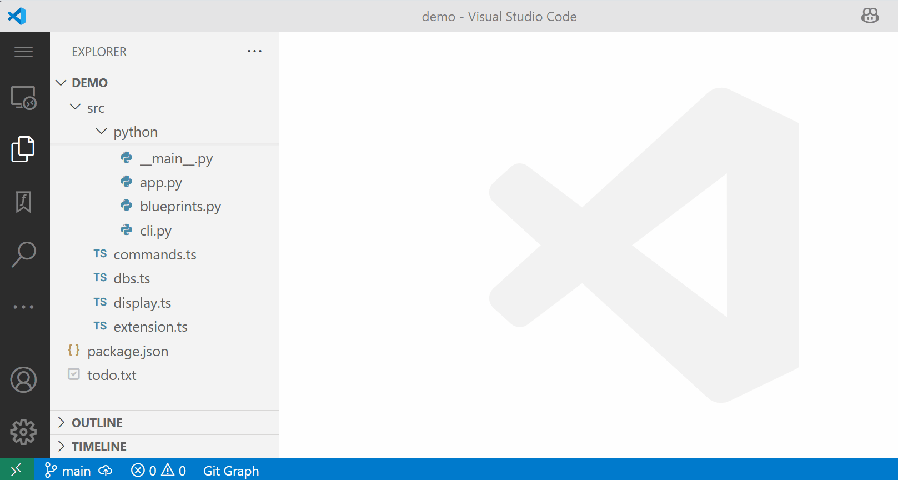
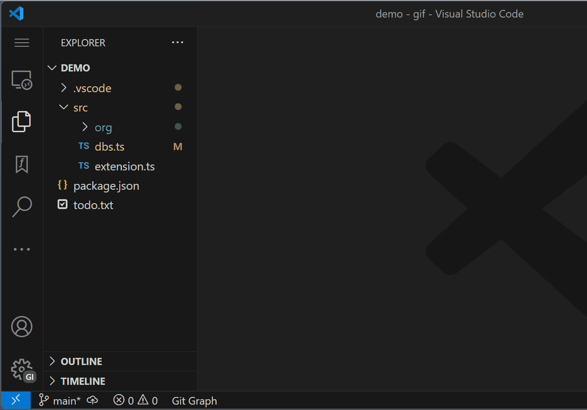

<div style="display: flex; align-items: center;">
  
  <span style="font-size:2em; margin-left: 12px;"><b>Function Explorer</b></span>
</div>

### Overview

Function Explorer is a vscode extension that provides a sidebar explorer much like the built-in file explorer. The big difference is that you can expand the file items to see and open their functions. It also features marking functions much like bookmarks.



### Two Major Features

#### Function Explorer

The Function Explorer shows folders, files, and functions. 

- The folders can be hidden so only files are shown. This enables a narrow width of the explorer freeing up space. Their path is optionally shown to the right of the name.

- Folders, such as node_modules, can be disabled in settings. Folders are only shown when enabled files are contained in the subtree.

- Functions can be marked (see below) and with a click the function list changes to only show marked items. This is useful for selecting a set of functions currently being worked on.

- Since each function has a name, each function in the explorer has a clean label.  No more showing a chopped-up line such as bookmarks have.

- The functions can be sorted by position or alphabetically and changed with a click in the file item.

- Clicking on a function brings it up in an  editor. The function is positioned in the editor in a number of optional ways. In each option the function is shown, not a line number.

- A top margin can be specified which guarantees a number of lines above the function are always visible. This is useful for comments like jsdocs.

- Double clicking the function name in the editor reveals that function in the explorer giving two-way linking.

#### Function Marks

This is the secomd major feature which ties in with the first.  Functions can be marked much like a bookmark. 



- There are the three common mark commands: toggle the function mark, navigate to the next mark or to the previous. You can navigate around the active file or all files.

- You can mark a function in five different ways.
  - Clicking the M symbol on an item in the explorer.
  - Using the `Toggle Function Mark` command in the command palette.
  - Right-clicking `Toggle Function Mark` in the editor context menu.
  - Using the keyboard `ctrl-alt-\`
  - Gesturing with the mouse on the function name.

- A mark symbol appears in the gutter by the first line of the function. Also a mark symbol appears next to the function name in the explorer. 


- As mentioned above the function list under a file can be filtered to only show marked functions. Each file can be set separately with a click.

### Functions

Functions are found using a syntax tree generated by the tree-sitter module. Functions can be declared functions, function expressions, methods, even arrow functions in js/ts files.

#### Other Syntax Types.

There are other syntax node types supported besides functions. These have an inferior role. Examples are imports, assignment statements, class declarations, function calls, etc.  The rule is that they have a name defined by the syntax that can be used in the explorer.

Just to keep things confusing, in this documentation the term function often refers to all syntax types. Hopefully the difference can be understood in context.

#### Marking Other Types.

 All syntax types can be marked the same way functions are. The marks appear in the gutter just like function marks and they are also used in navigation. 
 
 The explorer shows only actual functions by default but when another type of syntax is marked it also appears in the list until unmarked. This feature is important when using the marks like bookmarks. There needs to be a lot of marks for navigation.

 #### Symbols indicate the type of syntax node.

 When a name appears in the explorer it is prefixed by a symbol indicating it's type. They are `ƒ` for a function, `▷` for imports, `©` for classes/structs/enums, `=` for assignments, `π` for const declarations, and `(` for calls. There may be more as languages are added.  If you wonder why I didn't use vscode codicons it is because they make little sense to me (sorry).

 Function names at the beginning of labels have no `ƒ` in order to keep the function list clean.  All other type have their symbol prefixed and you can tell the functions by the lack of a symbol.

 #### Breadcrumbs

 To the right of the name is a breadcrumb list showing the nesting in the syntax tree. This is the same as the breadcrumbs at the top of the editor except only recognized types are shown. 

When the breadcrumbs on the right are identical to the the function above, a ditto mark `"` is shown instead. This keeps the explorer from being covered with in crumbs.

 Here are js examples. To the right of each code line is the label seen in the explorer. 

```
function aaa(){};           aaa
import * from './bbb';      ▷ bbb
class ccc {                 ©ccc
  ddd() {                   ddd © ccc
    function eee() {        eee © ccc ƒ ddd  
      const fff = 1;        = fff © ccc ƒ ddd ƒ eee
      const ggg = 1;        = ggg "
    }
  }
}
```

### Usage instructions.


#### Author: Mark Hahn (eridien)

#### Repo: https://github.com/eridien/vscode-function-explorer

#### Original Release: July 2025

#### License: MIT
