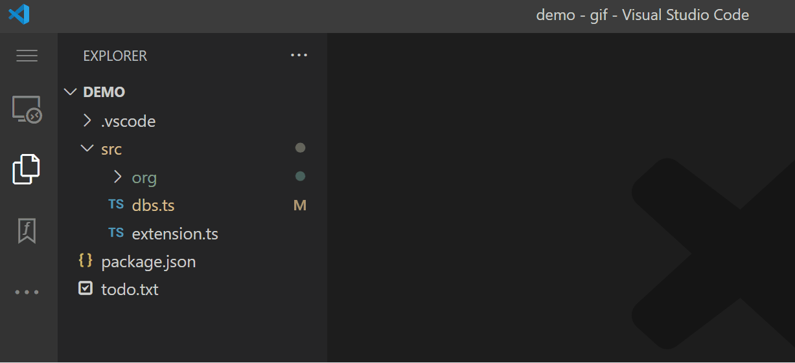

### Overview

Function Explorer is a vscode extension that provides a sidebar explorer much like the built-in file explorer. The big difference is that you can expand the file items to show their functions. It also features marking functions much like bookmarks.



### Two Major Features

#### Function Explorer

The Function Explorer shows folders, files, and functions. 

- Since each function has a name, each function in the explorer has a clean label, not a chopped line such as bookmarks have.

- Clicking on a function brings it up in an  editor. The function is positioned in the editor in a number of optional ways. In each option the function is shown, not a line number.

- A top margin can be specified which guarantees a number of lines above the function are always visible. This is useful for comments like jsdocs.

- Double clicking the function name in the editor reveals that function in the explorer giving two-way linking.

#### Function Marks

This is the second major feature which ties in with the first.  Functions can be marked much like a bookmark. 


- There are the three common mark commands: `Toggle Function Mark (ctrl-alt-\)`,  `Jump To Previous Mark (ctrl-alt-[)`, and `Jump To Next Mark (ctrl-alt-])`. You can navigate around the active file or, if the `File Wrap` option is enabled, all files with marks.

- There are also navigation commands to jump between all functions. The marks are ignored. If the `File Wrap` option is enabled then the jumps wrap to different files. The only files visited are the visible tabs. The tabs are visited in alphabetical order. The commands are `Jump To Previous Function (ctrl+alt+shift+[)` and `Jump To Next Function (ctrl+alt+shift+])`.

- When marked, a symbol appears in the gutter by the first line of the function. Also a mark symbol appears next to the function label in the explorer. 

 - You can also toggle a function mark by gesturing with the mouse. The guesture is to click in a function name, drag to anywhere outside the name, and go back and single-click on it.


  - The function list under a file can be filtered to only show marked functions. Each file can be set to filter its functions separately with a click or all can be set with a menu item. This lets you select the set of files you are working on.


### Files Supported

Currently only Javascript, Typescript, Python, C, C++, Java, C#, Go, and Rust are supported. Additional languages will be added frequently.  Put in your vote for languages to add in the repo issues.

### Functions

Functions are found using a syntax tree generated by the tree-sitter module. Functions can be declared functions, function expressions, methods, even arrow functions in js/ts files.

#### Other Syntax Types.

There are other syntax node types supported besides functions. These have an inferior role. Examples are imports, assignment statements, class declarations, function calls, etc.  The choice of types is somewhat arbitrary but they all must have a name that can be used in the explorer.

Just to keep things confusing, in this documentation the term function often refers to the other syntax types also. Hopefully the difference can be understood in context. There is a command `Show Syntax Nodes (ctrl-alt-shift-\)`to highlight all available names.  It is mostly for debugging but is also educational.


#### Marking Other Types.

 All syntax types can be marked the same way functions are. The marks appear in the gutter just like function marks and they are also used in navigation. 
 
 The explorer shows only actual functions by default but when another type of syntax node is marked it also appears in the list until unmarked. This feature is important when using the marks like bookmarks. There need to be a lot of marks for navigation.

 #### Symbols indicate the type of syntax node.

 When a name appears in the explorer it is prefixed by a symbol indicating it's type. They are `ƒ` for a function, `▷` for imports, `©` for classes/structs/enums, `=` for assignments, `π` for const declarations, and `(` for calls. There may be more as languages are added. Identifiers that don't appear in one of these syntax node types have `?` as the symbol.

 Function names at the beginning of labels have no `ƒ` in order to keep the function list clean.  All other type have their symbol prefixed and you can tell the functions by the lack of a symbol.

 #### Breadcrumbs

 To the right of the label is a optional breadcrumb list showing the nesting in the syntax tree. This is the same as the breadcrumbs at the top of an editor except only recognized nodes are shown. 

When the breadcrumbs on the right are identical to the the breadcrumbs above, a ditto mark `"` is optionally shown instead. This keeps the explorer from being covered with crumbs.

 Here are js examples. To the right of each code line is the label and its breadcrumbs as seen in the explorer. 

```
function aaa(){};           aaa
import * from './bbb';      ▷ bbb
class ccc {                 ©ccc
  ddd() {                   ddd © ccc
    function eee() {        eee © ccc ƒ ddd  
      const fff = 1;        = fff © ccc ƒ ddd ƒ eee
      const ggg = 1;        = ggg "
    }
  }
}
```

### Comparing To Bookmarks

The function marks have a lot in common with bookmarks but they are quite different. They are complementary and can be used together.

- Bookmarks work in any file with text. 

- Function marks are limited to a set of languages (see above).

- Bookmarks are line-number based and the bookmarks drift off from the marked code for a number of reasons. 

- Function marks are stored by the syntax path and they stay locked to the actual code.  You can even cut and paste code and the marks come along for the ride.

- Like bookmarks, function marks can be toggled with the cursor at any location.  But the actual mark is placed on the nearest available syntax node, usually within a few lines.

- In the bookmark explorer, bookmarks have labels that are parts of code on the line and often useless.  Also only marked lines are shown.

- Explorer function labels are always complete names, often with breadcrumbs.  All the functions, marked or not, are shown.  You can mark and unmark functions in the explorer without looking at code. 

- You can browse down the function list and mark the functions you are currently interested in, and then optionally show only those.  You can modify the list easily without visiting the code.

### File Icon Buttons In The Explorer.

- `✔` This toggles the mark filter in the file. When enabled all marked functions are shown and unmarked functions are hidden.  There is also a menu item at the top that enables the filter for all files.

- `A` This toggles the function list sort order between positional and alphabetical. The initial sorting for all files is determined by a setting.

- `⨉` This removes all function marks from the file.  This icon is also available on every folder, removing all in the folder, and there is a selection in the top menu that removes all marks in all root folders in the workspace.

- `▶` Since clicking on a file expands it showing its functions, the click doesn't open an editor as the File Explorer does.  This button does the equivalent opening.  There is also a setting to bring up the editor whenever the file is expanded.

- Each of these functions are also available in a context menu when the file is right-clicked.

### Settings

You can bring up the settings for the extension using the menu at the top of the explorer.

- **Hide Root Folders**. This hides the labels of root folders. It is only used when folders are visible. Default: disabled.

- **Hide All Folders**. This changes the explorer from a file tree to a list of files. This setting can be changed at any time in the explorer top menu.  Default: enabled.

- **Open Editors As Pinned**.  When an editor is brought up it can be pinned, like a double-click in the file explorer, or in preview mode letting the next editor replace it. Default: enabled.

- **Show File Paths**. When folders are hidden, the path to the file is shown after the file label. Default: enabled.

- **Breadcrumb Display**

  - **Never Show Breadcrumbs**
      The space to the right of explorer function labels will always be blank.

  - **Show Breadcrumbs With Dittos**
      Breadcrumbs, when available, will appear to the right of explorer function labels except for the breadcrumbs that are identical to the one above. Those matching will just show a ditto mark (quote character ` "`) reducing clutter. This is the default.

  - **Always Show Complete Breadcrumbs**
      Breadcrumbs, when available, will always appear to the right of explorer function labels.

- **Open File When Expanded**.  Whenever a file is expanded to show its functions the file is shown in an editor. Default: disabled.

- **File Wrap**.  When navigating by jumping between marks this option allows the jumps to wrap around all files instead of wrapping inside the active file. It even jumps between  files in different root folders. Default: enabled.

- **Scroll Position**

  - **Function Top At Top**
      The top of the function, including the margin, is positioned at the top of the window.

  - **Function Center At Center**
      This centers the function in the window. As in all other options the top of the function including the margin is always visible.

  - **Function Bottom At Bottom**
     The bottom of the function is positioned at the bottom of the window.
      
  - **Function Top At Top If Needed**
      Same as Top At Top unless the entire function is already visible and nothing is changed.

  - **Function Center At Center If Needed**
      Same as Center At Center unless the entire function is already visible and nothing is changed. This is the default.

  
- **Top Margin**
      The number of lines shown above the function.  This margin and the top of the function are *always* visible. Default: 3.

- **Alpha Sort Functions**
    This sets the initial value of the sort option, positional or alpha, for functions under the file. This setting can be changed at any time in the explorer top menu.  Default: Disabled.

- **Files/Folders To Exclude** Specifies files *and* folders to be ignored in the explorer. It contains glob patterns with commas. To exclude a directory end the glob pattern with a slash `/`, not `/**`.  A sample file is `**/*.js` and folder is `node_modules/`. Default: node_modules/

### Language Improvements ...

More languages and language improvements are always needed and are constantly being worked on. The language specifications needed to add a language are available in a single file `languages.ts`.  If you can help, look at that file to see what is involved. 

To work on language support, development of tree-sitter queries is required, but IMHO they are fun to work with. If you want to test your queries I can add a feature to the extension to use a file stored in .vscode. Let me know in the repo issues.

### Multiple Marks ...

Currently there is an area that needs improving. One problem (feature) is a consequence of storing marks as syntax fingerprints.  While this provides some great features it has one disadvantage. 

Adding a mark might show in multiple locations because they all match. This can look like a bug. This is rare in most languages like js/ts since multiple definitions at one nesting level are usually invalid. One could argue this is a feature.

A fix would be to add additional information to a mark based on line numbers.  But this would have the same drifting problem that bookmarks and breakpoints have.  Comments are welcome in the repo issues.

#### Author: Mark Hahn (eridien)

#### Marketplace: https://marketplace.visualstudio.com/items?itemName=eridien.vscode-function-explorer

#### Open VSX: https://open-vsx.org/extension/eridien/vscode-function-explorer

#### Repo: https://github.com/eridien/vscode-function-explorer

#### Original Release: August 2025

#### License: MIT
